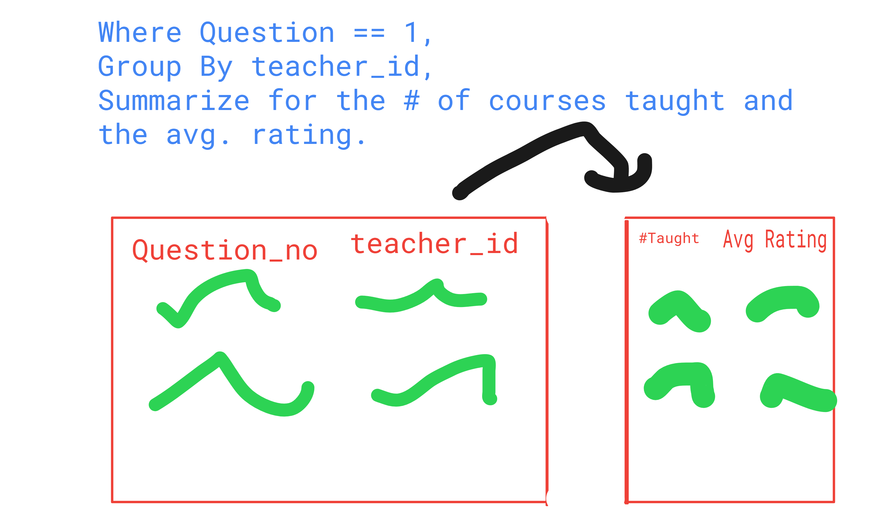

### Initialization

**1. Load the appropriate R packages and the `teacher_evals` data.**

```{r setup}
library(tidyverse)
library(dplyr)
library(knitr)
```

```{r}
teacher_data = read.csv(file = "teacher_evals.csv")
```

### Data Inspection + Summary


**2. Provide a brief overview (~4 sentences) of the dataset.**

```{r}
summary(teacher_data)
```
It can be seen from the data that the data on the teacher ratings has a lot of data relating to the metrics of the class as well as the teacher. This data will likely bring in some insight to how factors outside of the class itself can affect the overall rating of the class. Things such as time of day and duration of the class may have a positive or negative impact on a class as those metrics may affect a student's mood. For example, if a class if 6-9pm, which is an example of a long and late class, it is perhaps likely that they will rate the class lower as a byproduct of it as students will generally not want to be at class at that time of day for that long.
There are ~8000 rows of data, which is a good amount, and also there are a few columns to show the metrics of the teachers as well, such as gender, degree, etc. The questions also seem to be related to the question_no column, where 1-9 can be translated to 901-909. 

**3. What is the unit of observation (i.e. a single row in the dataset) identified by?**

One row of the data set is identified by the composite key of the three columns of course_id, teacher_id, and question_no. This makes sense as all these fields need to be used to identify a class from a specific teacher, from a specific course, and from that specific question. Any changes to these columns would point to a different classroom or question asked. 

**4. Use *one* `dplyr` pipeline to clean the data by**

 - **renaming the `gender` variable `sex`,**
 - **removing all courses with fewer than 10 students (participants),** 
 - **The `question_no` variable refers to the questions 1-9 in the survey, but weirdly takes the values 901-909. Update `question_no` so that it takes the values 1-9.**
 - **changing data types in whichever way you see fit (e.g., is the instructor ID really a numeric data type?), and** 
 - **only keeping the columns we will use -- `course_id`, `teacher_id`, `question_no`, `no_participants`, `resp_share`, `SET_score_avg`, `percent_failed_cur`, `academic_degree`, `seniority`, and `sex`.**
 
```{r}
teacher_evals_clean <- teacher_data |>
  rename(sex = gender) |> 
  select(course_id, teacher_id, question_no, no_participants, resp_share, SET_score_avg, percent_failed_cur, academic_degree, seniority, sex) |> 
  filter(no_participants >= 10) |> 
  mutate(question_no = question_no - 900) |> 
  mutate(teacher_id = as.character(teacher_id),
    course_id = as.character(course_id),
    academic_degree = as.factor(academic_degree),
    sex = as.factor(sex)
  )
```


**5. How many unique instructors and unique courses are present in the cleaned dataset?**

```{r}
n_distinct(teacher_evals_clean$teacher_id)
n_distinct(teacher_evals_clean$course_id)
```
There are 297 different teachers and 939 different courses.

**6. One teacher-course combination has some missing values, coded as `NA`. Which instructor has these missing values? Which course? What variable are the missing values in? Your code output should clearly answer this question.**

```{r}
teacher_evals_clean |>
  filter(if_any(everything(), is.na))
```
It seems course "PAB3SE004PA" and teacher ID "56347" have some missing values in percent_failed_cur, which is the percentage of students who failed that course taught by that instructor. 

**7. What are the demographics of the instructors in this study? Investigate the variables `academic_degree`, `seniority`, and `sex` and summarize your findings in ~3 complete sentences.**


```{r}
instructors <- teacher_evals_clean |>
  distinct(teacher_id, .keep_all = TRUE)

n_instructors = n_distinct(teacher_evals_clean$teacher_id)

instructors |>
  count(academic_degree) |>
  mutate(prop = n / n_instructors)

instructors |>
  count(sex) |>
  mutate(prop = n / n_instructors)

instructors |>
  count(seniority) |>
  mutate(prop = n / n_instructors)
```
Instructors in this data set seem to be majority doctorate degree holders, with about a quarter having master's degree. Interestingly, the next highest percentage degree level is no degree, where it then vastly drops down to professor. It's interesting to note that there doesn't seem to be instances of bachelor's degree holders here.
In terms of sex, there seems to be slightly more male instructors than female ones, with about ~10 percentage points more male professors than female ones.
The seniority data is quite interesting as a lot of the data is frontloaded into the first two years, with about 40% of the total being there. Interestingly there is a jump of instructor instances at the instructors' 6th year, but other years stay around 5-8%.

**8. Each course seems to have used a different subset of the 9 evaluation questions. How many teacher-course combinations asked all 9 questions? Your output should be a single number to answer the question.**

```{r}
teacher_evals_clean |> 
  group_by(teacher_id, course_id) |> 
  summarize(n_questions = n_distinct(question_no), 
            .groups = "drop_last") |> 
  filter(n_questions == 9) |> 
  nrow()
```
49 combinations.

## Rate my Professor

For the questions in this section (9 - 11), you don't need to write up any answers -- you only need to show the output of your code (nicely formatted with `kable()`) to respond to each. Your code output should clearly show the answer.

**9. Which instructor(s) had the lowest average rating for Question 1 ("I learnt a lot during the course.") *across all their courses* (i.e. you should be looking at the mean of the `SET_score_avg` variable across courses for each instructor)? Include the number of courses the instructor(s) taught in your output**

**a. Sketch what the output to answer this question should look like and include an image of your sketch below. Write a plan for the steps to get from `teacher_evals_clean` to this output.**



**b. Implement your plan**

```{r}
teacher_evals_clean |>
  filter(question_no == 1) |>
  group_by(teacher_id) |>
  summarize(
    mean_rating = mean(SET_score_avg),
    n_courses = n_distinct(course_id),
    .groups = "drop_last"
  ) |>
  slice_min(mean_rating) |> 
kable(
    col.names = c("Teacher ID", "Average Rating", "Number of Courses Taught"),
    caption = "Teachers with Lowest Average Rating for Question 1"
)
```

**10. Which instructor(s), who had *at least five* courses reviewed in the data, had the highest average rating for Question 1 (I learnt a lot during the course.) across all their courses?**

```{r}
teacher_evals_clean |>
  filter(question_no == 1)  |>
  group_by(teacher_id) |>
  summarize(
    n_courses = n_distinct(course_id),
    mean_rating = mean(SET_score_avg),
    .groups = "drop_last") |>
  filter(n_courses >= 5) |> 
  slice_max(mean_rating) |> 
kable(
    col.names = c("Teacher ID", "Number of Courses", "Average Rating"),
    caption = "Teachers with Highest Average Rating for Question 1 (At least 5 classes taught.)"
)
```


**11. Which instructor(s) with either a doctorate or professor degree had the highest and lowest average percent of students responding to the evaluation across all their courses? Include how many years the instructor had worked (seniority) and their sex in your output. You can use two pipelines to answer these questions.**


```{r}
teacher_evals_clean |>
  filter(academic_degree == "dr" | academic_degree == "prof")  |>
  group_by(teacher_id) |>
  summarize(
    percent_response = mean(resp_share),
    seniority = first(seniority),
    sex = first(sex),
    .groups = "drop_last") |>
  slice_max(percent_response) |> 
kable(
    col.names = c("Teacher ID", "Percent Response", "Years Worked", "Sex"),
    caption = "Teacher with Highest Response Rate"
)
```

```{r}
teacher_evals_clean |>
  filter(academic_degree == "dr" | academic_degree == "prof")  |>
  group_by(teacher_id) |>
  summarize(
    percent_response = mean(resp_share),
    seniority = first(seniority),
    sex = first(sex),
    .groups = "drop_last") |>
  slice_min(percent_response) |> 
kable(
    col.names = c("Teacher ID", "Percent Response", "Years Worked", "Sex"),
    caption = "Teacher with Lowest Response Rate"
)
```

## Chi-Square Test of Independence

**12. Create a new dataset `teacher_evals_compare` that accomplishes the following with one `dplyr` pipeline:** 

1. **includes responses for Question 3 only,**
2. **creates a new variable called `set_level` that is “excellent” if the `SET_score_avg` is 4 or higher (inclusive) and “standard” otherwise,**
3. **creates a new variable called `sen_level` that is “junior” if the instructor has been teaching for 4 years or less (inclusive), “senior” if between 5-8 years (inclusive), and "very senior" if more than 8 years**
4. **contains only the variables we are interested in – `course_id`, `set_level`, and `sen_level`.**


```{r}
teacher_evals_compare <- teacher_evals_clean |> 
  filter(question_no == 3) |>
  mutate(
    set_level = case_when(
      SET_score_avg >= 4 ~ "Excellent",
      .default = "Standard"),
    sen_level = case_when(
      seniority > 8 ~ "Very Senior",
      seniority > 4 ~ "Senior",
      .default = "Junior"
    )
  ) |> 
  select(course_id, set_level, sen_level)
```

**13. Using the new dataset and your `ggplot2` skills, recreate the filled bar plot shown on the lab instructions online.**


```{r}
ggplot(teacher_evals_compare, aes(x = sen_level,
                                  fill = set_level)) +
  geom_bar(position = "fill") + 
  labs(
    y = "",
    x = "Seniority of Intructor",
    title = "Evaluation of In-Class Activity Use by Intructor Seniority",
    subtitle = "Conditional Proportion of Sections",
    fill = "SET level"
  ) + 
  scale_fill_manual(
    values = c("Excellent" = "#154734", "Standard" = "#BD8B13")
  )
```

**14. Use `chisq.test()` to carry out a chi-square test of independence between the SET level and instructor seniority level in your new dataset. You will want to look at the documentation and maybe Google a bit!**

```{r}
with(teacher_evals_compare,
     chisq.test(table(set_level, sen_level)))
```

**15. Draw a conclusion about the independence of student evaluation of instructor's use of activities and seniority level based on your chi-square test.**

Since the p-value is so low (below the standard 0.05), it can be concluded that the null hypothesis can be rejected. As such it can be concluded that there is an association between the two variables of SET level and instructor seniority.

### Study Critique

**16. If you were to conduct this study at Cal Poly, what are two other variables you would like to collect that you think might be related to student evaluations? These should be course or instructor characteristics that were not collected in this study. Explain what effects you would expect to see for each.**

I would additionally add the following:

is_major field that would track if the class was along the student's major class path, or if it was a GE class. This would be useful as it could further show an association between students and how much they care for a class based on its content.

units field that would track how many units a class is. It's possible that classes with less units may prove to be less important to students, meaning there might be less responses for those classes. For an example, a 1 unit kinematics class (I.E bowling), would likely not have many instructor reviews. 
