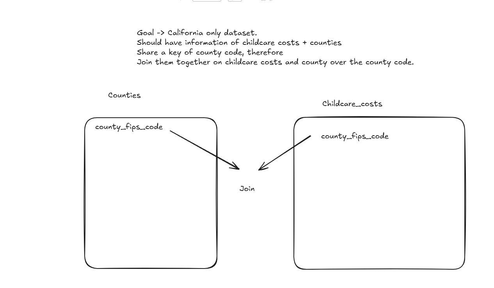

## The Data

**0. Load the appropriate libraries and the data.**

```{r setup}
library(tidyverse)
library(dplyr)
```

```{r load_data, echo=FALSE, message=FALSE}
# load data
childcare_costs <- read_csv('https://raw.githubusercontent.com/rfordatascience/tidytuesday/master/data/2023/2023-05-09/childcare_costs.csv')
counties <- read_csv('https://raw.githubusercontent.com/rfordatascience/tidytuesday/master/data/2023/2023-05-09/counties.csv')

tax_rev <- read_csv('https://raw.githubusercontent.com/manncz/stat-331-s25/main/labs/lab4/data/ca_tax_revenue.csv')
```

**1. Briefly describe the data (~ 4 sentences). What information does it contain?**

The childcare costs csv contains a lot of information about various rates, such as unemployment rate, labor force participation rate, poverty rates, population counts, etc. It's sorted by county and year, and most importantly contains information on median price charged for center based care and family childcare. The counties data has an ID that can be linked to the previous dataset that has the full county name, state, and state abreviation. Finally, the tax_rev csv has data on taxes such as property tax and sales and use tax, and it seems to be linked to the counties dataset on the county name. 


## California Childcare Costs

**2. Let's focus only on California. Create a `ca_childcare` dataset containing (1) county information and (2) all information from the `childcare_costs` dataset.**

**a. Sketch a plan for completing this task and include an image of the sketch or write out the steps of your plan in plain english (not with function names!). You should do all of this within one pipeline**



**b. Implement/code your game plan to create the dataset of childcare costs in California.** *Checkpoint: There are 58 counties in CA and 11 years in the dataset. Therefore, your new dataset should have 638 observations.*

```{r}
ca_childcare <- counties |> 
  filter(state_name == "California") |>
  inner_join(childcare_costs, by = "county_fips_code")
```


**3. Now, lets add the tax revenue information to the `ca_childcare` dataset. Add the data from `tax_rev` for the counties and years that are already in the `ca_childcare` data. Overwrite the old `ca_childcare` data with this dataset.** *Checkpoint: you are just adding columns here, so your new dataset should still have 638 observations*

```{r}
ca_childcare <- ca_childcare |> 
  left_join(tax_rev, join_by(county_name == entity_name, study_year == year))
```


**4. Using a function from the `forcats` package, complete the code below to create a new variable where each county is categorized into one of the [10 Census regions](https://census.ca.gov/regions/) in California. Use the Region description (from the plot), not the Region number (e.g. "Superior California" not "1").** The code below will help you get started.

```{r}
#| code-fold: true

# defining 10 census regions

superior_counties <- c("Butte","Colusa","El Dorado",
                       "Glenn","Lassen","Modoc",
                       "Nevada","Placer","Plumas",
                       "Sacramento","Shasta","Sierra","Siskiyou",
                       "Sutter","Tehama","Yolo","Yuba")

north_coast_counties <- c("Del Norte","Humboldt","Lake",
                          "Mendocino","Napa","Sonoma","Trinity")

san_fran_counties <- c("Alameda","Contra Costa","Marin",
                       "San Francisco","San Mateo","Santa Clara",
                       "Solano")

n_san_joaquin_counties <- c("Alpine","Amador","Calaveras","Madera",
                            "Mariposa","Merced","Mono","San Joaquin",
                            "Stanislaus","Tuolumne")

central_coast_counties <- c("Monterey","San Benito","San Luis Obispo",
                            "Santa Barbara","Santa Cruz","Ventura")

s_san_joaquin_counties <- c("Fresno","Inyo","Kern","Kings","Tulare")

inland_counties <- c("Riverside","San Bernardino")

la_county <- "Los Angeles"

orange_county  <- "Orange"

san_diego_imperial_counties <- c("Imperial","San Diego")
```

```{r}
ca_childcare <- ca_childcare |> 
  mutate(
    county_name = str_remove(county_name, " County"),
    region = fct_collapse(
      as.factor(county_name),
      "Superior California" = superior_counties,
      "North Coast" = north_coast_counties,
      "San Francisco Counties" = san_fran_counties,
      "North San Joaquin Valley" = n_san_joaquin_counties,
      "Central Coast" = central_coast_counties,
      "South San Joaquin Valley" = s_san_joaquin_counties,
      "Inland Counties" = inland_counties,
      "Los Angeles" = la_county,
      "Orange County" = orange_county,
      "San Diego and Imperial" = san_diego_imperial_counties
    )
  )
#glimpse(ca_childcare)
```


**5. Let's consider the median household income of each region, and how that income has changed over time. Create a table with ten rows, one for each region, and three columns, 2008 income, 2018  income, and region. The cells should contain the `median()` of the median household income (expressed in 2018 dollars) of the `region` and the `study_year`. Order the rows by 2018 values from highest income to lowest income.**


```{r}
median_table <- ca_childcare |>
  filter(study_year %in% c(2008, 2018)) |>
  group_by(region, study_year) |>
  summarize(
    mhi_2018 = median(mhi_2018),
    .groups = "drop") |>
  pivot_wider(
    names_from = study_year,
    values_from = mhi_2018,
    names_prefix = "income ") |>
  arrange(desc(`income 2018`))
```


**6. Which California `region` had the lowest `median` full-time median weekly price for center-based childcare for infants in 2018? Does this `region` correspond to the `region` with the lowest `median` income in 2018 that you found in Q4?**

```{r}
childcare_table <- ca_childcare |>
  filter(study_year == 2018) |>
  group_by(region) |>
  summarize(
    mc_infant = median(mc_infant),
    .groups = "drop") |>
  filter(mc_infant == min(mc_infant))

childcare_table
```

The results show that Superior California had the lowest median full time median weekly price. This does not match with the lowest median income region, which was the North Coast region.

**7. The following plot shows, for all ten regions, the change over time of the full-time median price for center-based childcare for infants, toddlers, and preschoolers. Recreate the plot. You do not have to replicate the exact colors or theme, but your plot should have the same content, including the order of the facets and legend, reader-friendly labels, axes breaks, and a loess smoother.**

```{r}
#| fig-width: 10
#| fig-height: 6
ca_childcare |> 
  select(mc_infant, mc_toddler, mc_preschool, study_year, region) |> 
  pivot_longer(
    cols = c(mc_infant, mc_toddler, mc_preschool),
    names_to = "care_type",
    values_to = "cost") |> 
  mutate(
    care_type = recode(care_type,
      mc_infant = "Infant",
      mc_toddler = "Toddler",
      mc_preschool = "Preschool"),
  ) |> 
  ggplot(aes(x = study_year, 
             y = cost, 
             color = region)) +
  geom_point(alpha = 0.3) +
  geom_smooth(se = FALSE, 
              linewidth = 1) +
  facet_wrap(~care_type) +
  scale_y_continuous(limits = c(0, 500)) +
  scale_x_continuous(breaks = seq(2008, 2018, by = 2)) +
  labs(
    x = "Study Year",
    y = NULL,
    color = "California Region",
    title = "Weekly Median Price for Center-Based Childcare ($)"
  ) +
  theme(aspect.ratio = 1)
```

## Median Household Income vs. Childcare Costs for Infants

**8. Create a scatterplot showing the relationship between median household income (expressed in 2018 dollars) and the full-time median weekly price charged for center-based childcare for an infant in California. Overlay a linear regression line (lm) to show the trend.**

```{r}
ca_childcare |> 
  ggplot(aes(
    x = mhi_2018,
    y = mc_infant)) +
  geom_point(alpha = 0.6) +
  geom_smooth(method = "lm", se = FALSE) +
  labs(
    x = "Median Household Income (2018 dollars)",
    y = "Weekly Median Infant Childcare Cost",
    title = "Relationship Between Income and Infant Childcare Cost in California")
```

**9. Look up the documentation for `lm()` and fit a linear regression model to the relationship shown in your plot above (recall: $y = mx+b$). Identify the coefficient estimates from the model.**

```{r}
reg_mod1 <- lm(mc_infant ~ mhi_2018, data = ca_childcare)
summary(reg_mod1)
```
y = 0.0002241*mhi_2018 + 131.7.

Meaning that the efficient estimate is 0.0002241. 
Every 1$ increase in income seems to increase the price by 0.0002241.

**10. Do you have evidence to conclude there is a relationship between the median household income and the median weekly cost of center-based childcare for infants in California? Cite values from your output for support.**

Yes, there is a positive relationship. The slope is positive, and as income increases so does the cost. The p-value is very small, confirming that this is accurate.The R^2 value explains 63.5% of the variability in the childcare costs, which means there is a solid relationship.

## Open-Ended Analysis

**11. Posit and investigate a research question involving at least two variables in this dataset. Present exactly one table of summary statistics and one plot that helps to address your research question.**


Research Question: How does the percentage of single-mother households with children under 6 relate to childcare costs?


```{r}
#| fig-width: 10
#| fig-height: 6
ca_childcare <- ca_childcare |> 
  mutate(pct_single_mother = h_under6_single_m / households)

summary_table <- ca_childcare |>
  group_by(region) |>
  summarize(
    pct_single_mother = mean(pct_single_mother),
    infant_cost = median(mc_infant),
    toddler_cost = median(mc_toddler),
    preschool_cost = median(mc_preschool),
    .groups = "drop") |>
  arrange(desc(pct_single_mother))

summary_table

ca_childcare |>
  pivot_longer(
    cols = c(mc_infant, mc_toddler, mc_preschool),
    names_to = "care_type",
    values_to = "cost") |>
  mutate(
    care_type = recode(care_type,
      mc_infant = "Infant",
      mc_toddler = "Toddler",
      mc_preschool = "Preschool")) |>
  ggplot(aes(x = pct_single_mother, y = cost, color = region)) +
  geom_point(alpha = 0.5, size = 1.5) +
  geom_smooth(method = "lm", 
              se = FALSE, 
              linewidth = 1) +
  facet_wrap(~care_type) +
  labs(
    x = "Proportion of Single-Mother Households",
    y = "Weekly Childcare Cost",
    color = "California Region",
    title = "Childcare Costs vs. Share of Single Mother Households") +
  theme(aspect.ratio = 1)

```
**Table Description**

The table above shows per region, the percentages of single mothers as well as the median cost per type, being the types infant, toddler, and preschooler. Looking at the data, it seems that there is generally a negative relationship between single mothers and the cost values meaning the more single mothers in an area, the less the cost of the childcare. However it does contain exceptions. For example, Los Angeles and the Central Coast seem to have higher costs across the board, despite having lower single mother percentages than one would think.

It seems like the negative relationship may be due to other factors than the single mother percentage, and as is known, correlation does not equal causation. There are exceptions in the Central Coast and Los Angeles as previously stated, and there seems to be more to the data that doesn't confirm a strong relationship between these variables, despite there being some evidence.

**Plot Description** 
  
The plot shows childcare costs versus the percentage of single mother households. The plot shows a negative relationship, like said before, and it can be seen that all slopes here are negative. It still seems like regional differences cause the highest difference in childcare costs. Goin back to the research question, it seems like there is a small relationship between the percentage of single-mother households with children under 6 and childcare costs, however I would not say that its a "causal" relationship. It's likely that the underlying relationship might be that regions that are less rich have higher single mother rates, and also less costs on their childcare. This relates to Q7, as we have shown previously that higher income places have higher prices on their childcare costs.  
